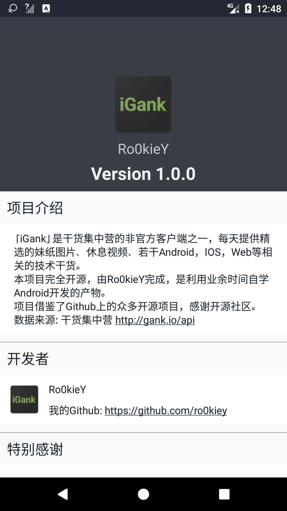
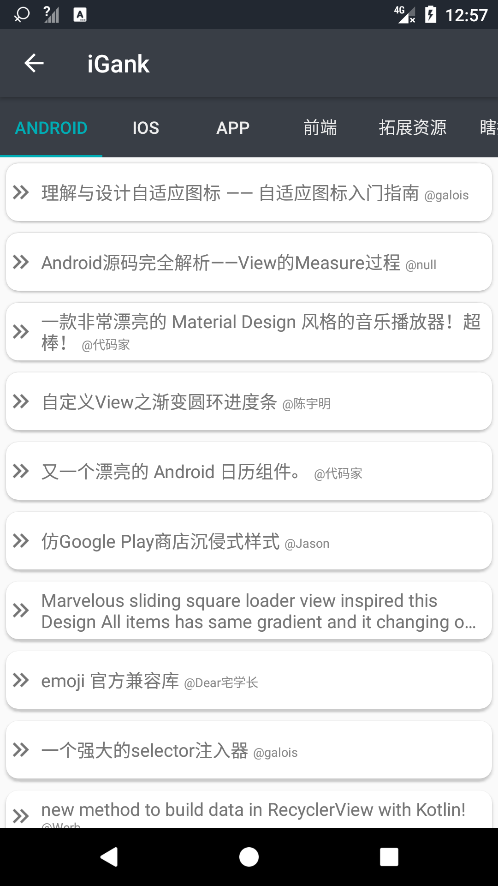

# iGank

A simple client for Gank.io in order to learn Android development. Based on MVP + RxJava2 + Retrofit2.  

「iGank」是干货集中营的非官方客户端之一，每天提供精选的妹纸图片、休息视频、若干Android，IOS，Web等相关的技术干货。本项目完全开源，由Ro0kieY完成，是利用业余时间自学Android开发的产物。项目借鉴了Github上的众多开源项目，感谢开源社区。  

水平有限，如果你觉得该项目对你有帮助，欢迎Star和Fork。

## 效果预览
  
  

## 数据来源
干货集中营 http://gank.io/api

## 开源库
com.google.code.gson:gson:2.8.1  
com.squareup.retrofit2:retrofit:2.3.0'  
com.squareup.retrofit2:converter-gson:2.3.0'  
com.squareup.retrofit2:adapter-rxjava2:2.3.0'  
io.reactivex.rxjava2:rxandroid:2.0.1'  
io.reactivex.rxjava2:rxjava:2.1.0'  
com.android.support:design:25.3.1'  
com.github.bumptech.glide:glide:3.8.0'  
me.zhanghai.android.materialprogressbar:library:1.4.1'  
com.jakewharton:butterknife:8.7.0'  
com.github.clans:fab:1.6.4'  
