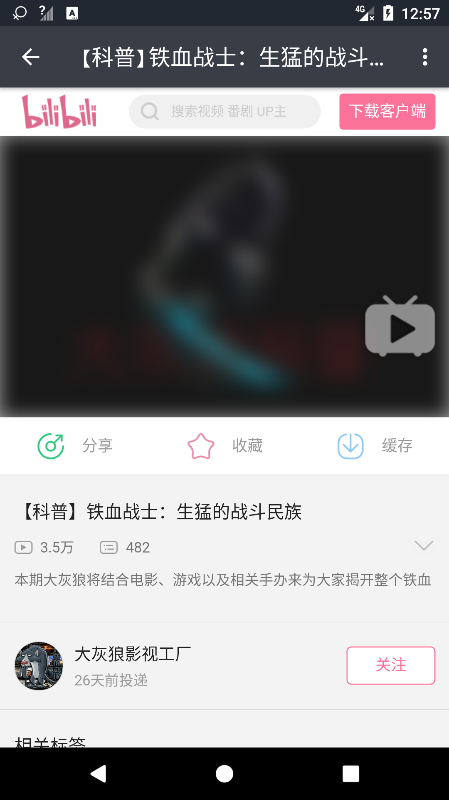

# iGank

A simple client for Gank.io in order to learn Android development. Based on MVP + RxJava2 + Retrofit2.  

「iGank」是干货集中营的非官方客户端之一，每天提供精选的妹纸图片、休息视频、若干Android，IOS，Web等相关的技术干货。  

本项目完全开源，由Ro0kieY完成，是利用业余时间自学Android开发的产物。项目借鉴了Github上的众多开源项目，感谢开源社区。  

主页采取了卡片流式布局，点击图片可查看大图，点击卡片下的文字可进入每日干货，右下角的『FAB』可切换布局和进入分类浏览界面。  

水平有限，项目还有很多不足，适合新人学习，大家如果有什么建议或者疑惑，欢迎联系。

## 知识点
 - [MVP设计模式](https://github.com/Ro0kieY/MVPDemo)
 - Retrofit2 + Rxjava2异步网络请求
 - 沉浸式状态栏
 - 下拉刷新，上拉加载更多
 - 线性、流式布局动态切换
 - TabLayout + ViewPager + Fragment  
 
更多详情请查看源码...

## 效果预览
  
  

## 数据来源
干货集中营 http://gank.io/api

